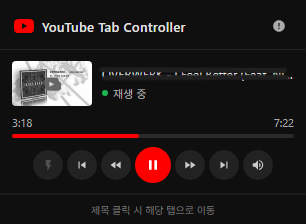

# YouTube Tab Controller

Chrome 익스텐션으로, 열려있는 유튜브 영상 탭들을 툴바 팝업에서 한눈에 보고 제어할 수 있습니다.

<div align="center">
  
</div>

---

## 기능

- 열린 유튜브 `/watch` 탭 자동 감지 및 목록 표시
- 탭별 재생 / 일시정지
- 탭별 -10초 / +10초 스킵
- 이전 영상 / 다음 영상 전환
- 음소거 토글
- 진행 바 표시 및 클릭으로 시킹
- 현재 시간 / 전체 시간 표시 (250ms 단위 실시간 업데이트)
- 영상 썸네일 및 제목 표시
- 영상 전환 시 썸네일·제목 자동 갱신
- 탭별 자동 재개 ON/OFF 토글 (⚡)
- 재생 시 다른 탭 자동 일시정지
- 카드 클릭 시 해당 탭으로 이동
- 이미 열린 탭 자동 감지 (새로고침 불필요)
- 한 번도 열지 않은 탭은 목록에 표시되지 않음 (Chrome 구조적 한계)

---

## 설치 방법

1. 이 저장소를 클론하거나 ZIP으로 다운로드
2. Chrome 주소창에 `chrome://extensions` 입력
3. 우측 상단 **개발자 모드** 활성화
4. **"압축해제된 확장 프로그램을 로드합니다"** 클릭
5. `youtube-controller` 폴더 선택

---

## 파일 구조

```
youtube-controller/
├── manifest.json     # 익스텐션 설정 (MV3)
├── background.js     # 서비스 워커 — 탭 감지 및 content.js 주입
├── content.js        # 유튜브 탭 내 동작 — 영상 제어 및 메시지 핸들러
├── popup.html        # 팝업 UI 마크업 및 스타일
├── popup.js          # 팝업 로직 — 탭 목록 렌더링 및 제어
└── icons/
    ├── icon16.png
    ├── icon48.png
    └── icon128.png
```

---

## 변경 이력

### v1.0 — 최초 구현

- 툴바 아이콘 클릭 시 팝업으로 유튜브 탭 목록 표시
- 재생 / 일시정지 버튼
- -10초 / +10초 스킵 버튼
- 음소거 토글 버튼
- 재생 중인 탭 상태 표시 (초록 점)
- 탭 클릭 시 해당 탭으로 포커스 이동
- content.js + popup.js 구조로 메시지 기반 통신

---

### v1.1 — 진행 바 및 아이콘 추가

- 진행 바 추가 (현재 시간 / 전체 시간 표시)
- 진행 바 클릭으로 원하는 위치로 시킹 가능
- 툴바 아이콘 추가 (빨간 배경 + 흰 삼각형, Python 순수 PNG 생성)
- manifest에 최상위 `icons` 필드 추가 (익스텐션 관리 페이지용)

---

### v1.2 — 영상 페이지 필터링 및 탭 간 상호작용

- `/watch?v=` URL인 탭만 팝업에 표시 (홈·검색·채널 페이지 제외)
- 재생 누르면 다른 유튜브 탭 자동 일시정지
- 자동 재개 기능 추가: 익스텐션이 직접 pause하지 않은 경우에만 재개

---

### v1.3 — 렌더링 최적화 (스크롤 버벅임 수정)

- 2초마다 전체 DOM을 재생성하던 방식 제거
- 탭 카드를 처음 한 번만 생성하고 변경된 부분만 DOM 패치
- 진행 바를 250ms 별도 루프로, 재생 상태를 2초마다 분리 업데이트
- 스크롤 위치가 튀던 문제 해결

---

### v1.4 — 이미 열린 탭 자동 감지

- `background.js` 서비스 워커 추가
- `onInstalled`, `onStartup`, `tabs.onUpdated` 이벤트에서 자동 주입
- 익스텐션 설치 전 이미 열려있던 탭도 새로고침 없이 즉시 감지

---

### v1.5 — 이중 주입 및 플래그 버그 수정

- `window.__ytc` 가드 + IIFE로 content.js 이중 실행 완전 차단
- `let` 변수 재선언으로 인한 `SyntaxError` 해결
- `_extDidPause` 플래그를 video DOM 프로퍼티에 저장하여 인스턴스 간 공유 보장
- 자동 재개가 익스텐션의 pause 명령을 덮어쓰던 버그 수정

---

### v1.6 — 메인 플레이어 정확한 감지

- `#movie_player video` 셀렉터로 광고·미리보기 video와 메인 플레이어 구분
- `getVideo()` fallback: duration이 가장 긴 video를 메인으로 판단
- 홈화면 접속 시 의도치 않게 표시되던 문제 수정

---

### v1.7 — 명령 체계 개편 (stale closure 버그 수정)

- `popup.js`의 `executeScript` 직접 호출 완전 제거
- 모든 명령을 `chrome.tabs.sendMessage` 경유로 통일
- 버튼 클릭 시 클로저의 낡은 상태 대신 실시간 `getState` 재조회
- 일시정지 버튼이 동작하지 않던 근본 원인 해결

---

### v1.8 — 썸네일 표시

- 탭 URL의 `?v=` 파라미터로 영상 ID 추출
- `https://i.ytimg.com/vi/{videoId}/mqdefault.jpg`로 썸네일 직접 로드
- 썸네일 로드 실패 시 유튜브 아이콘으로 fallback 처리

---

### v1.9 — 자동 재개 탭별 토글

- ⚡ 버튼으로 탭마다 자동 재개 ON/OFF 독립 설정 (기본값 OFF)
- `setAutoResume` 메시지 핸들러 추가
- `autoResumeEnabled` 상태를 content.js IIFE 스코프 내에서 관리

---

### v2.0 — 전체 재작성 (안정성 강화)

- manifest에서 `content_scripts` 선언 제거 → background.js 단독 주입으로 이중 주입 원천 차단
- `ping → pong` 체크 후 주입 → 중복 주입 방지
- MV3 서비스 워커 비영구성 대응: 팝업의 `ensureInjected` 자체 폴백 추가
- 한 번도 열지 않은 탭(Chrome 지연 복원)은 목록에서 완전히 숨김
- ℹ️ 아이콘으로 이 동작을 팝업 내에서 안내
- 컨트롤러 전용 아이콘으로 교체 (재생 버튼 + 진행 바, 4× 슈퍼샘플링 AA)
- 전체 텍스트·아이콘 밝기 개선으로 가독성 향상

---

### v2.1 — 다음/이전 영상 전환

- ⏮ 이전 영상: 재생 위치 3초 이상이면 처음으로, 아니면 재생목록 이전 영상
- ⏭ 다음 영상: YouTube 플레이어 next 버튼 클릭 (재생목록/자동재생 연동)
- 영상 전환 시 카드의 URL 변경을 감지하여 썸네일·제목 자동 갱신
- 컨트롤 버튼 순서: ⚡ ⏮ ⏪ ▶/⏸ ⏩ ⏭ 🔊

---

## 알려진 한계

| 상황                                      | 동작                                              |
| ----------------------------------------- | ------------------------------------------------- |
| Chrome 재시작 후 한 번도 클릭하지 않은 탭 | 목록에 표시되지 않음 (Chrome 지연 복원 구조 한계) |
| 자동 재개 ON 상태                         | YouTube 광고 종료 시점에도 재개될 수 있음         |
| 이전 영상 버튼                            | 재생목록 없는 단일 영상에서는 처음으로만 이동     |

---

## 기술 스택

- **Manifest V3** Chrome Extension
- **Vanilla JS** (프레임워크 없음)
- 탭 간 통신: `chrome.tabs.sendMessage` / `chrome.runtime.onMessage`
- 스크립트 주입: `chrome.scripting.executeScript`
- 아이콘: Python 순수 PNG 생성 (4× 슈퍼샘플링 안티앨리어싱)
